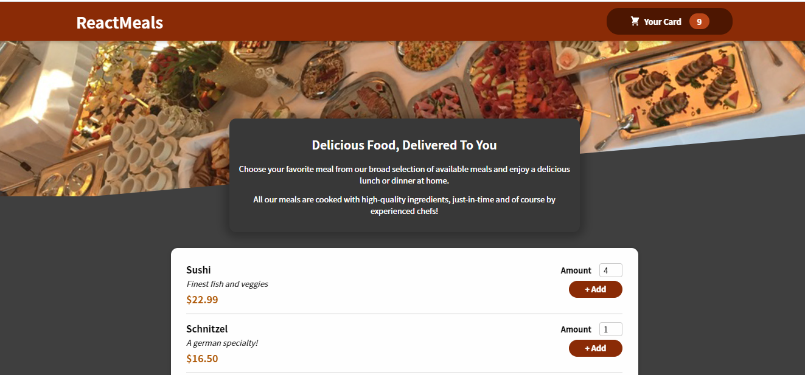

# Food Order App

A nice food order application where you can order food.

## Table of contents

- [Overview](#overview)
  - [The app](#the-app)
  - [Screenshot](#screenshot)
  - [Built with](#built-with)
  - [Used Features](#used-features)
- [Author](#author)

## Overview

### The app

Users should be able to:

- View the optimal layout depending on their device's screen size
- Initially, they can view their meal options
- They can add the foods they choose to the shopping card with the add button
- They can view the number and calculated prices of the meals they add on the shopping card
- They can increase or remove items on the shopping card

### Screenshot

### Built with

- React.JS
- CSS custom properties
- CSS Modules

### Used Features
- useState
- useEffect
- React Portals
- useReducer
- useContext

## Author

- Website - [Damla Kara](https://www.linkedin.com/in/damla-kara-348081232/)